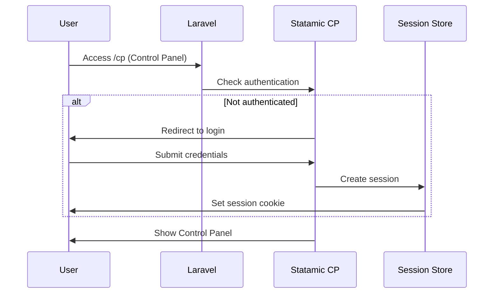

# Backend Architecture

## Service Architecture

### Traditional Server Architecture
Since we're using Laravel with Inertia.js, this follows a traditional MVC pattern:

#### Controller Organization
```
app/Http/Controllers/
├── PageController.php      # Main page rendering
├── ContactController.php   # Form submissions
├── PostController.php      # Blog/insights
└── Admin/                  # Admin-specific controllers
    └── DashboardController.php
```

#### Controller Template
```php
<?php

namespace App\Http\Controllers;

use Illuminate\Http\Request;
use Inertia\Inertia;
use Inertia\Response;

class PageController extends Controller
{
    public function home(): Response
    {
        $page = \Statamic\Facades\Entry::findByUri('/');
        
        return Inertia::render('Home', [
            'page' => $page->toArray(),
            'blocks' => $this->processBlocks($page->get('content', []))
        ]);
    }
    
    private function processBlocks(array $blocks): array
    {
        // Transform Statamic blocks for frontend consumption
        return collect($blocks)->map(function ($block) {
            return [
                'type' => $block['type'],
                'data' => $block['data'] ?? [],
                'enabled' => $block['enabled'] ?? true
            ];
        })->toArray();
    }
}
```

## Database Architecture

### Schema Design
```sql
-- Primary tables are handled by Statamic's flat-file system
-- Database is used for performance-critical data and sessions

-- Form submissions for lead tracking
CREATE TABLE form_submissions (
    id BIGINT UNSIGNED NOT NULL AUTO_INCREMENT PRIMARY KEY,
    form VARCHAR(255) NOT NULL,
    data JSON NOT NULL,
    ip_address VARCHAR(45) NULL,
    user_agent TEXT NULL,
    created_at TIMESTAMP NULL,
    updated_at TIMESTAMP NULL,
    INDEX idx_form_created (form, created_at)
);

-- Analytics events for PostHog integration
CREATE TABLE analytics_events (
    id BIGINT UNSIGNED NOT NULL AUTO_INCREMENT PRIMARY KEY,
    event_name VARCHAR(255) NOT NULL,
    properties JSON NULL,
    user_id VARCHAR(255) NULL,
    session_id VARCHAR(255) NULL,
    created_at TIMESTAMP NULL,
    INDEX idx_event_user (event_name, user_id),
    INDEX idx_created_at (created_at)
);
```

### Data Access Layer
```php
<?php

namespace App\Repositories;

class FormSubmissionRepository
{
    public function create(array $data): FormSubmission
    {
        return FormSubmission::create([
            'form' => $data['form'],
            'data' => $data['data'],
            'ip_address' => request()->ip(),
            'user_agent' => request()->userAgent()
        ]);
    }
    
    public function getRecentSubmissions(string $form, int $limit = 10): Collection
    {
        return FormSubmission::where('form', $form)
            ->latest()
            ->limit($limit)
            ->get();
    }
}
```

## Authentication and Authorization

### Auth Flow


### Middleware/Guards
```php
<?php

namespace App\Http\Middleware;

use Closure;
use Illuminate\Http\Request;

class StatamicAuthMiddleware
{
    public function handle(Request $request, Closure $next)
    {
        // Statamic handles its own authentication
        // This middleware can add additional security layers
        
        if ($request->is('cp/*') && !$this->isAuthorizedIP($request)) {
            abort(403, 'Access denied from this IP address');
        }
        
        return $next($request);
    }
    
    private function isAuthorizedIP(Request $request): bool
    {
        $allowedIPs = config('statamic.cp.allowed_ips', []);
        
        if (empty($allowedIPs)) {
            return true;
        }
        
        return in_array($request->ip(), $allowedIPs);
    }
}
```