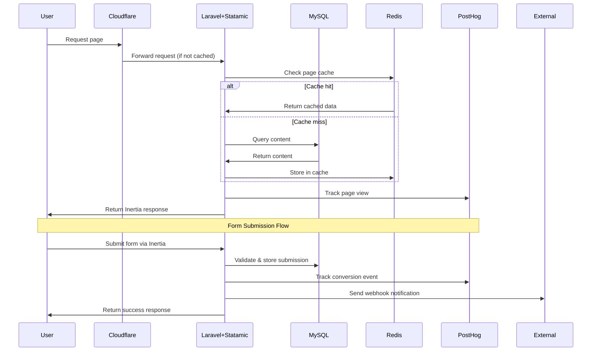

# Core Workflows

```mermaid
sequenceDiagram
    participant User
    participant CDN as Cloudflare
    participant App as Laravel+Statamic
    participant DB as MySQL
    participant Cache as Redis
    participant Analytics as PostHog
    
    User->>CDN: Request page
    CDN->>App: Forward request (if not cached)
    App->>Cache: Check page cache
    alt Cache hit
        Cache->>App: Return cached data
    else Cache miss
        App->>DB: Query content
        DB->>App: Return content
        App->>Cache: Store in cache
    end
    App->>Analytics: Track page view
    App->>User: Return Inertia response
    
    Note over User,Analytics: Form Submission Flow
    User->>App: Submit form via Inertia
    App->>DB: Validate & store submission
    App->>Analytics: Track conversion event
    App->>External: Send webhook notification
    App->>User: Return success response
```