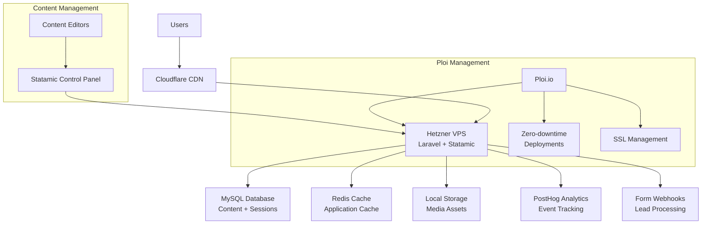
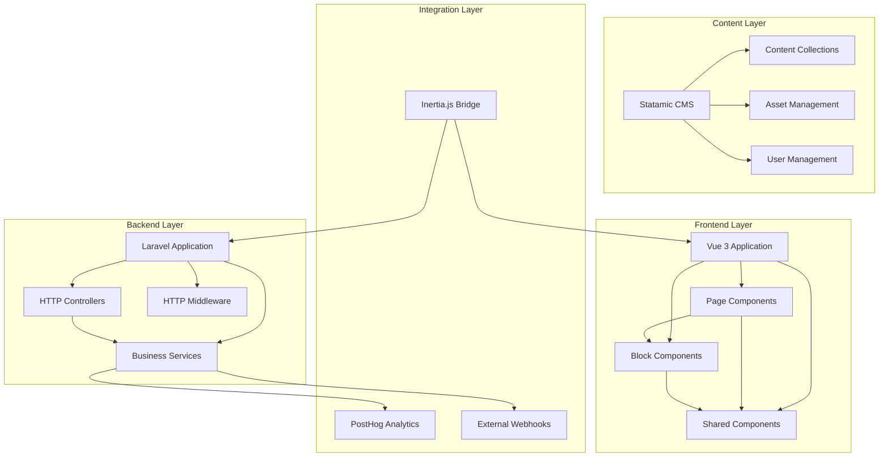
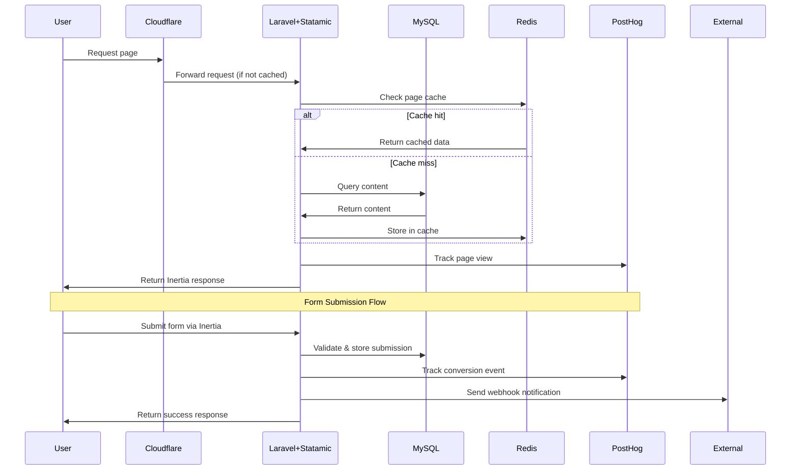
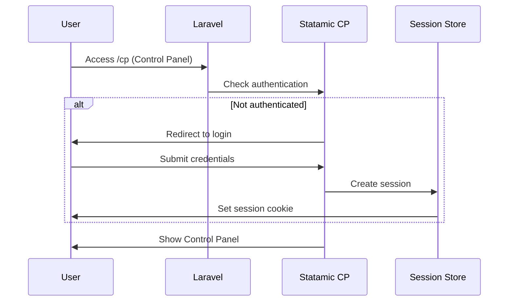
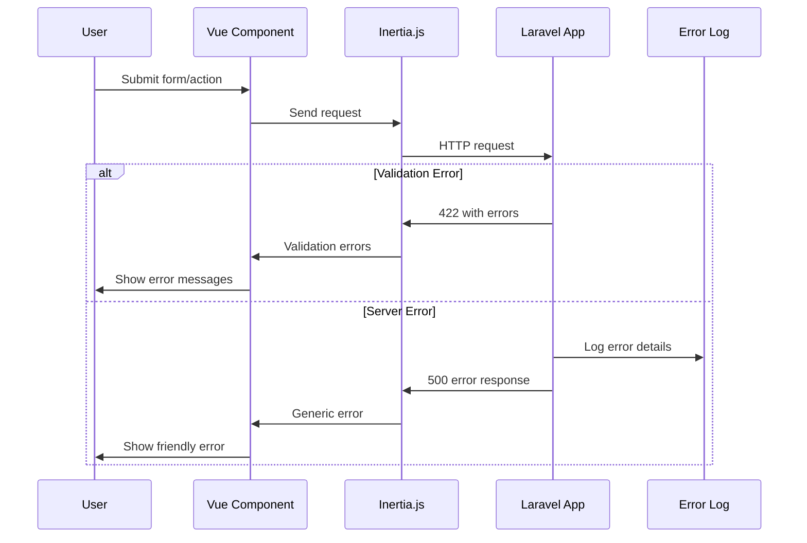

# Smartcraft Marketing Website Fullstack Architecture Document

## Introduction

This document outlines the complete fullstack architecture for **Smartcraft Marketing Website**, including backend systems, frontend implementation, and their integration. It serves as the single source of truth for AI-driven development, ensuring consistency across the entire technology stack.

This unified approach combines what would traditionally be separate backend and frontend architecture documents, streamlining the development process for modern fullstack applications where these concerns are increasingly intertwined.

### Starter Template or Existing Project

**Decision**: N/A - Greenfield project with predefined technology stack

Based on the PRD analysis, this is a **greenfield project** with specific technology choices already defined:
- **Backend**: Laravel 12 + Statamic (latest stable)  
- **Frontend**: Inertia.js + Vue 3 (latest) + Vite (latest) + Tailwind (latest)
- **Approach**: Full-stack Laravel application with Inertia.js bridging backend and frontend

The PRD explicitly specifies the tech stack, indicating this is not based on a starter template but rather a custom implementation using these specific technologies.

### Change Log
| Date | Version | Description | Author |
|------|---------|-------------|--------|
| 2025-09-05 | 1.0 | Initial architecture document | Winston (Architect) |

## High Level Architecture

### Technical Summary

The Smartcraft marketing website employs a **modern monolithic architecture** using Laravel 12 as the foundational framework with Statamic CMS for content management, bridged to a Vue 3 frontend via Inertia.js for SPA-like user experience. This architecture delivers enterprise-grade performance and security while maintaining the rapid development velocity of a content-managed system. The platform leverages **server-side rendering with client-side navigation**, providing optimal SEO benefits and user experience. Infrastructure deployment targets Hetzner Cloud via Ploi.io with Cloudflare CDN integration for global performance, aligning with the aggressive performance targets of LCP < 2.5s while supporting the complex page builder and analytics requirements.

### Platform and Infrastructure Choice

**Platform:** Hetzner Cloud via Ploi.io  
**Key Services:** Hetzner VPS, MySQL database, Redis cache, Ploi-managed deployments  
**Deployment Host and Regions:** Hetzner datacenter (EU), Cloudflare CDN for global performance

This approach aligns perfectly with the "WordPress pricing with enterprise features" positioning - leveraging cost-effective hosting while maintaining performance through CDN optimization.

### Repository Structure

**Structure:** Standard Laravel application structure  
**Monorepo Tool:** N/A - Standard Laravel project  
**Package Organization:** Laravel conventions with Statamic integration

```
smartcraft/
├── app/                    # Laravel application logic
├── resources/js/           # Vue 3 + Inertia frontend  
├── resources/views/        # Minimal Blade layouts for Inertia
├── content/               # Statamic content files
├── config/                # Laravel + Statamic configuration
├── public/                # Compiled assets + static files
└── storage/               # File uploads, cache, logs
```

### High Level Architecture Diagram



### Architectural Patterns

- **Simple Monolith:** Single Laravel application with Statamic - *Rationale:* Cost-effective, maintainable, aligns with hosting constraints
- **Content-First Architecture:** Statamic collections drive page structure via replicator fields - *Rationale:* Enables non-technical content management
- **Component-Based UI:** Reusable Vue 3 components mapped to Statamic blocks - *Rationale:* Flexible page building with consistent UI
- **File-Based Content:** Statamic's flat-file approach with database for performance-critical data - *Rationale:* Simplifies content management and version control
- **Event-Driven Analytics:** Laravel events for PostHog tracking - *Rationale:* Clean separation of analytics from business logic

## Tech Stack

| Category | Technology | Version | Purpose | Rationale |
|----------|------------|---------|---------|-----------|
| Frontend Language | TypeScript | 5.x | Type-safe frontend development | Prevents runtime errors, improves developer experience |
| Frontend Framework | Vue 3 | 3.x | Reactive UI framework | Modern composition API, excellent performance, TypeScript support |
| UI Component Library | Tailwind CSS | 3.x | Utility-first CSS framework | Rapid development, consistent design system, small bundle size |
| State Management | Pinia | 2.x | Vue state management | Official Vue store, TypeScript-first, developer-friendly |
| Backend Language | PHP | 8.3+ | Server-side language | Mature Laravel ecosystem, cost-effective hosting |
| Backend Framework | Laravel | 12.x | Full-stack PHP framework | Rapid development, excellent ORM, strong ecosystem |
| CMS | Statamic | 5.x | Flat-file CMS | Content management without database complexity, version control friendly |
| Frontend Bridge | Inertia.js | 1.x | SPA-like experience with server routing | Modern UX without API complexity |
| API Style | Inertia Responses | Latest | JSON responses for Inertia | Seamless frontend-backend integration |
| Database | MySQL | 8.0 | Primary database | Reliable, well-supported, cost-effective |
| Cache | Redis | 7.x | Application and session cache | High performance caching and session storage |
| File Storage | Local Storage | N/A | Media and static assets | Simple, cost-effective for single-server setup |
| Authentication | Statamic Users | Latest | User management and authentication | Built-in CMS user system, sufficient for content editors |
| Frontend Testing | Vitest | 1.x | Unit testing for Vue components | Fast, modern testing framework |
| Backend Testing | PHPUnit | 10.x | Laravel application testing | Standard Laravel testing framework |
| E2E Testing | Playwright | 1.x | End-to-end testing | Cross-browser testing, reliable automation |
| Build Tool | Vite | 5.x | Frontend build system | Fast development server, optimized builds |
| Bundler | Vite | 5.x | JavaScript bundling | Modern bundler with excellent Vue support |
| IaC Tool | Ploi.io | Latest | Server provisioning and management | Automated Laravel hosting management |
| CI/CD | GitHub Actions | Latest | Continuous integration and deployment | Free for public repos, excellent Laravel ecosystem |
| Monitoring | Laravel Telescope | Latest | Application debugging and monitoring | Built-in Laravel debugging and monitoring |
| Logging | Laravel Log | Latest | Application logging | Standard Laravel logging with daily rotation |
| CSS Framework | Tailwind CSS | 3.x | Utility-first styling | Consistent design system, rapid development |

## Data Models

### Page
**Purpose:** Represents all website pages using Statamic's flexible page builder approach

**Key Attributes:**
- id: string - Unique page identifier
- title: string - Page title for SEO and navigation
- slug: string - URL-friendly identifier
- template: string - Blade template to use for rendering
- content: array - Replicator field containing page blocks
- seo_title: string - SEO optimized title
- meta_description: string - Page meta description
- published: boolean - Publication status

#### TypeScript Interface
```typescript
interface Page {
  id: string;
  title: string;
  slug: string;
  template: string;
  content: Block[];
  seo_title?: string;
  meta_description?: string;
  published: boolean;
  created_at: string;
  updated_at: string;
}
```

#### Relationships
- Has many blocks through content replicator field
- Belongs to site taxonomy

### Block
**Purpose:** Individual content blocks that make up pages (Hero, Packages, etc.)

**Key Attributes:**
- type: string - Block type identifier (hero, packages, comparison, etc.)
- data: object - Block-specific configuration and content
- enabled: boolean - Whether block is active
- order: number - Display order on page

#### TypeScript Interface
```typescript
interface Block {
  type: string;
  data: Record<string, any>;
  enabled: boolean;
  order?: number;
}
```

#### Relationships
- Belongs to Page through replicator field

### Post
**Purpose:** Blog posts and insights content

**Key Attributes:**
- id: string - Unique post identifier
- title: string - Post title
- slug: string - URL-friendly identifier
- content: string - Post content using Bard field
- excerpt: string - Short description
- published_at: datetime - Publication date
- author: string - Content author
- categories: array - Post categories
- featured_image: string - Main post image

#### TypeScript Interface
```typescript
interface Post {
  id: string;
  title: string;
  slug: string;
  content: string;
  excerpt?: string;
  published_at: string;
  author?: string;
  categories: string[];
  featured_image?: string;
  seo_title?: string;
  meta_description?: string;
}
```

#### Relationships
- Belongs to categories taxonomy
- May have featured image asset

## API Specification

Since this application uses Inertia.js, there is no traditional REST API. Instead, Inertia provides JSON responses for page data and form submissions.

### Inertia Response Format

```typescript
interface InertiaResponse {
  component: string;
  props: Record<string, any>;
  url: string;
  version: string;
}
```

### Key Inertia Endpoints

**Page Rendering:**
- `GET /` - Home page with hero, packages, and key blocks
- `GET /packages` - Service packages comparison
- `GET /services/{service}` - Individual service pages
- `GET /process` - SMART process explanation
- `GET /case-studies` - Case studies listing and details
- `GET /insights` - Blog posts and insights
- `GET /about` - Company information
- `GET /contact` - Contact forms and information

**Form Submissions:**
- `POST /contact` - Contact form submission
- `POST /rfp` - RFP form submission
- `POST /subscribe` - Newsletter subscription

**Admin/CMS:**
- `GET /cp` - Statamic Control Panel (authentication required)

## Components

### Frontend Application (Vue 3)
**Responsibility:** Handles user interface, interactions, and client-side logic

**Key Interfaces:**
- Page components for each route/template
- Reusable block components matching Statamic blocks
- Shared UI components (buttons, forms, layouts)
- Composables for common functionality

**Dependencies:** Inertia.js for server communication, Pinia for state management

**Technology Stack:** Vue 3 Composition API, TypeScript, Tailwind CSS, Vite

### Laravel Application Core
**Responsibility:** Server-side business logic, routing, and data processing

**Key Interfaces:**
- HTTP controllers for page rendering and form processing
- Middleware for authentication, security, and performance
- Services for business logic (lead processing, analytics)
- Event listeners for tracking and integrations

**Dependencies:** Statamic CMS, MySQL database, Redis cache

**Technology Stack:** Laravel 12, PHP 8.3+, Statamic 5.x

### Statamic CMS
**Responsibility:** Content management, user authentication, and file-based content storage

**Key Interfaces:**
- Control Panel for content editing
- Collections API for content retrieval
- User management and authentication
- Asset management for images and files

**Dependencies:** Laravel application core, local file system

**Technology Stack:** Statamic 5.x with flat-file content storage

### Analytics Service
**Responsibility:** Event tracking, user behavior analysis, and performance monitoring

**Key Interfaces:**
- PostHog integration for event tracking
- Laravel event system for data collection
- Custom analytics dashboard (future enhancement)

**Dependencies:** PostHog external service, Laravel events

**Technology Stack:** Laravel events, PostHog JavaScript SDK

### Component Diagrams



## External APIs

### PostHog Analytics
- **Purpose:** User behavior tracking, conversion analytics, and performance monitoring
- **Documentation:** https://posthog.com/docs/api
- **Base URL:** https://app.posthog.com/
- **Authentication:** API key authentication
- **Rate Limits:** 1000 requests per minute per project

**Key Endpoints Used:**
- `POST /capture/` - Event tracking
- `GET /api/projects/{id}/events/` - Event retrieval for analysis

**Integration Notes:** Events are sent from both server-side (Laravel) and client-side (Vue) for comprehensive tracking

### Form Webhook Integrations
- **Purpose:** Lead processing and CRM integration for contact forms
- **Documentation:** To be configured based on chosen CRM
- **Base URL:** Various webhook endpoints
- **Authentication:** Bearer tokens or webhook signatures
- **Rate Limits:** Varies by provider

**Key Endpoints Used:**
- `POST /webhook/contact` - Contact form submissions
- `POST /webhook/rfp` - RFP form submissions

**Integration Notes:** Statamic forms can be configured to send to multiple webhook endpoints simultaneously

## Core Workflows



## Database Schema

```sql
-- Statamic uses flat files for content, but some data needs database storage

-- Sessions table (Laravel)
CREATE TABLE sessions (
    id VARCHAR(255) NOT NULL PRIMARY KEY,
    user_id BIGINT UNSIGNED NULL,
    ip_address VARCHAR(45) NULL,
    user_agent TEXT NULL,
    payload LONGTEXT NOT NULL,
    last_activity INT NOT NULL,
    INDEX sessions_user_id_index (user_id),
    INDEX sessions_last_activity_index (last_activity)
);

-- Cache table for application caching
CREATE TABLE cache (
    key VARCHAR(255) NOT NULL PRIMARY KEY,
    value MEDIUMTEXT NOT NULL,
    expiration INT NOT NULL
);

-- Form submissions (Statamic forms)
CREATE TABLE form_submissions (
    id BIGINT UNSIGNED NOT NULL AUTO_INCREMENT PRIMARY KEY,
    form VARCHAR(255) NOT NULL,
    data JSON NOT NULL,
    created_at TIMESTAMP NULL,
    updated_at TIMESTAMP NULL,
    INDEX form_submissions_form_index (form)
);

-- Failed jobs queue
CREATE TABLE failed_jobs (
    id BIGINT UNSIGNED NOT NULL AUTO_INCREMENT PRIMARY KEY,
    uuid VARCHAR(255) NOT NULL UNIQUE,
    connection TEXT NOT NULL,
    queue TEXT NOT NULL,
    payload LONGTEXT NOT NULL,
    exception LONGTEXT NOT NULL,
    failed_at TIMESTAMP DEFAULT CURRENT_TIMESTAMP
);

-- Job batches for queue processing
CREATE TABLE job_batches (
    id VARCHAR(255) NOT NULL PRIMARY KEY,
    name VARCHAR(255) NOT NULL,
    total_jobs INT NOT NULL,
    pending_jobs INT NOT NULL,
    failed_jobs INT NOT NULL,
    failed_job_ids LONGTEXT NOT NULL,
    options MEDIUMTEXT NULL,
    cancelled_at INT NULL,
    created_at INT NOT NULL,
    finished_at INT NULL
);
```

## Frontend Architecture

### Component Architecture

#### Component Organization
```
resources/js/
├── Components/           # Reusable UI components
│   ├── UI/              # Base UI elements (buttons, inputs, etc.)
│   ├── Blocks/          # Statamic block components
│   ├── Layout/          # Layout components (header, footer, nav)
│   └── Forms/           # Form components
├── Pages/               # Inertia page components
├── Composables/         # Vue composition functions
├── Stores/              # Pinia stores
├── Types/               # TypeScript type definitions
└── Utils/               # Utility functions
```

#### Component Template
```typescript
<template>
  <div class="component-wrapper">
    <slot />
  </div>
</template>

<script setup lang="ts">
interface Props {
  // Define component props
}

const props = defineProps<Props>()
const emit = defineEmits<{
  // Define component events
}>()

// Component logic using Composition API
</script>
```

### State Management Architecture

#### State Structure
```typescript
// stores/main.ts
export const useMainStore = defineStore('main', () => {
  const loading = ref(false)
  const user = ref(null)
  const flashMessages = ref([])
  
  const setLoading = (value: boolean) => {
    loading.value = value
  }
  
  return {
    loading,
    user,
    flashMessages,
    setLoading
  }
})
```

#### State Management Patterns
- Use Pinia for global application state
- Keep component-specific state local using refs/reactive
- Use composables for shared business logic
- Leverage Inertia's built-in form handling for form state

### Routing Architecture

#### Route Organization
```
routes/web.php handles all routing:
├── / (home)
├── /packages (service packages)
├── /services/{service} (individual services)
├── /process (SMART methodology)
├── /case-studies (portfolio)
├── /insights (blog)
├── /about (company info)
└── /contact (contact forms)

Statamic handles content routing automatically
```

#### Protected Route Pattern
```typescript
// middleware/auth.ts (Inertia middleware)
export default function auth(next: Function) {
  if (!user.value) {
    return redirect('/login')
  }
  return next()
}
```

### Frontend Services Layer

#### API Client Setup
```typescript
// services/api.ts
import { router } from '@inertiajs/vue3'

export const api = {
  post: (url: string, data: any, options = {}) => {
    return router.post(url, data, {
      preserveScroll: true,
      ...options
    })
  },
  
  visit: (url: string, options = {}) => {
    return router.visit(url, {
      preserveState: true,
      ...options
    })
  }
}
```

#### Service Example
```typescript
// services/contact.ts
export const contactService = {
  submitForm: async (formData: ContactForm) => {
    return api.post('/contact', formData, {
      onSuccess: () => {
        // Handle success
      },
      onError: (errors) => {
        // Handle validation errors
      }
    })
  }
}
```

## Backend Architecture

### Service Architecture

#### Traditional Server Architecture
Since we're using Laravel with Inertia.js, this follows a traditional MVC pattern:

##### Controller Organization
```
app/Http/Controllers/
├── PageController.php      # Main page rendering
├── ContactController.php   # Form submissions
├── PostController.php      # Blog/insights
└── Admin/                  # Admin-specific controllers
    └── DashboardController.php
```

##### Controller Template
```php
<?php

namespace App\Http\Controllers;

use Illuminate\Http\Request;
use Inertia\Inertia;
use Inertia\Response;

class PageController extends Controller
{
    public function home(): Response
    {
        $page = \Statamic\Facades\Entry::findByUri('/');
        
        return Inertia::render('Home', [
            'page' => $page->toArray(),
            'blocks' => $this->processBlocks($page->get('content', []))
        ]);
    }
    
    private function processBlocks(array $blocks): array
    {
        // Transform Statamic blocks for frontend consumption
        return collect($blocks)->map(function ($block) {
            return [
                'type' => $block['type'],
                'data' => $block['data'] ?? [],
                'enabled' => $block['enabled'] ?? true
            ];
        })->toArray();
    }
}
```

### Database Architecture

#### Schema Design
```sql
-- Primary tables are handled by Statamic's flat-file system
-- Database is used for performance-critical data and sessions

-- Form submissions for lead tracking
CREATE TABLE form_submissions (
    id BIGINT UNSIGNED NOT NULL AUTO_INCREMENT PRIMARY KEY,
    form VARCHAR(255) NOT NULL,
    data JSON NOT NULL,
    ip_address VARCHAR(45) NULL,
    user_agent TEXT NULL,
    created_at TIMESTAMP NULL,
    updated_at TIMESTAMP NULL,
    INDEX idx_form_created (form, created_at)
);

-- Analytics events for PostHog integration
CREATE TABLE analytics_events (
    id BIGINT UNSIGNED NOT NULL AUTO_INCREMENT PRIMARY KEY,
    event_name VARCHAR(255) NOT NULL,
    properties JSON NULL,
    user_id VARCHAR(255) NULL,
    session_id VARCHAR(255) NULL,
    created_at TIMESTAMP NULL,
    INDEX idx_event_user (event_name, user_id),
    INDEX idx_created_at (created_at)
);
```

#### Data Access Layer
```php
<?php

namespace App\Repositories;

class FormSubmissionRepository
{
    public function create(array $data): FormSubmission
    {
        return FormSubmission::create([
            'form' => $data['form'],
            'data' => $data['data'],
            'ip_address' => request()->ip(),
            'user_agent' => request()->userAgent()
        ]);
    }
    
    public function getRecentSubmissions(string $form, int $limit = 10): Collection
    {
        return FormSubmission::where('form', $form)
            ->latest()
            ->limit($limit)
            ->get();
    }
}
```

### Authentication and Authorization

#### Auth Flow


#### Middleware/Guards
```php
<?php

namespace App\Http\Middleware;

use Closure;
use Illuminate\Http\Request;

class StatamicAuthMiddleware
{
    public function handle(Request $request, Closure $next)
    {
        // Statamic handles its own authentication
        // This middleware can add additional security layers
        
        if ($request->is('cp/*') && !$this->isAuthorizedIP($request)) {
            abort(403, 'Access denied from this IP address');
        }
        
        return $next($request);
    }
    
    private function isAuthorizedIP(Request $request): bool
    {
        $allowedIPs = config('statamic.cp.allowed_ips', []);
        
        if (empty($allowedIPs)) {
            return true;
        }
        
        return in_array($request->ip(), $allowedIPs);
    }
}
```

## Unified Project Structure

```
smartcraft/
├── .github/                    # CI/CD workflows
│   └── workflows/
│       ├── ci.yml
│       └── deploy.yml
├── app/                        # Laravel application
│   ├── Http/
│   │   ├── Controllers/        # Page and form controllers
│   │   ├── Middleware/         # Custom middleware
│   │   └── Requests/           # Form request validation
│   ├── Services/               # Business logic services
│   ├── Repositories/           # Data access layer
│   ├── Events/                 # Laravel events for analytics
│   └── Listeners/              # Event listeners
├── resources/                  # Frontend and views
│   ├── js/                     # Vue 3 application
│   │   ├── Components/         # Vue components
│   │   │   ├── Blocks/         # Statamic block components
│   │   │   ├── Layout/         # Layout components
│   │   │   └── UI/             # Shared UI components
│   │   ├── Pages/              # Inertia page components
│   │   ├── Composables/        # Vue composition functions
│   │   ├── Stores/             # Pinia stores
│   │   ├── Types/              # TypeScript definitions
│   │   └── app.ts              # Vue app entry point
│   ├── views/                  # Minimal Blade layouts
│   ├── css/                    # Tailwind CSS
│   └── lang/                   # Language files
├── content/                    # Statamic content
│   ├── collections/            # Content collections
│   ├── globals/                # Global content
│   ├── assets/                 # Asset containers
│   └── users/                  # Content editors
├── config/                     # Laravel + Statamic config
├── database/                   # Database migrations
├── storage/                    # File storage and cache
├── public/                     # Web root and compiled assets
├── tests/                      # Application tests
│   ├── Feature/                # Laravel feature tests
│   ├── Unit/                   # Laravel unit tests
│   └── E2E/                    # Playwright tests
├── .env.example                # Environment template
├── package.json                # Frontend dependencies
├── composer.json               # PHP dependencies
├── vite.config.js              # Vite configuration
├── tailwind.config.js          # Tailwind configuration
├── playwright.config.ts        # E2E test configuration
└── README.md
```

## Development Workflow

### Local Development Setup

#### Prerequisites
```bash
# Install PHP 8.3+, Composer, Node.js 18+, MySQL, Redis
php --version  # Should be 8.3+
composer --version
node --version  # Should be 18+
npm --version
mysql --version
redis-cli --version
```

#### Initial Setup
```bash
# Clone and install dependencies
git clone <repository-url> smartcraft
cd smartcraft
composer install
npm install

# Environment setup
cp .env.example .env
php artisan key:generate
php artisan storage:link

# Database setup
php artisan migrate
php artisan statamic:install

# Build frontend assets
npm run build
```

#### Development Commands
```bash
# Start all services
php artisan serve &
npm run dev &
redis-server &

# Start frontend only
npm run dev

# Start backend only
php artisan serve

# Run tests
php artisan test           # Laravel tests
npm run test              # Frontend tests
npm run test:e2e          # E2E tests
```

### Environment Configuration

#### Required Environment Variables
```bash
# Frontend (.env - used by Vite)
VITE_APP_NAME="Smartcraft"
VITE_POSTHOG_KEY=your_posthog_key
VITE_POSTHOG_HOST=https://app.posthog.com

# Backend (.env)
APP_NAME="Smartcraft"
APP_ENV=local
APP_KEY=base64:generated_key
APP_DEBUG=true
APP_URL=http://localhost:8000

DB_CONNECTION=mysql
DB_HOST=127.0.0.1
DB_PORT=3306
DB_DATABASE=smartcraft
DB_USERNAME=root
DB_PASSWORD=

CACHE_DRIVER=redis
SESSION_DRIVER=redis
QUEUE_CONNECTION=redis

REDIS_HOST=127.0.0.1
REDIS_PASSWORD=null
REDIS_PORT=6379

# Shared
STATAMIC_LICENSE_KEY=your_license_key
STATAMIC_STACHE_WATCHER=true
STATAMIC_STATIC_CACHING_STRATEGY=null
```

## Deployment Architecture

### Deployment Strategy

**Frontend Deployment:**
- **Platform:** Hetzner VPS via Ploi.io
- **Build Command:** `npm run build`
- **Output Directory:** `public/build`
- **CDN/Edge:** Cloudflare for global asset delivery

**Backend Deployment:**
- **Platform:** Hetzner VPS via Ploi.io  
- **Build Command:** `composer install --optimize-autoloader --no-dev`
- **Deployment Method:** Zero-downtime deployment via Ploi

### CI/CD Pipeline
```yaml
name: CI/CD Pipeline

on:
  push:
    branches: [main, develop]
  pull_request:
    branches: [main]

jobs:
  test:
    runs-on: ubuntu-latest
    steps:
      - uses: actions/checkout@v4
      
      - name: Setup PHP
        uses: shivammathur/setup-php@v2
        with:
          php-version: 8.3
          extensions: dom, curl, libxml, mbstring, zip, pcntl, pdo, sqlite, pdo_sqlite
          
      - name: Setup Node.js
        uses: actions/setup-node@v4
        with:
          node-version: 18
          cache: 'npm'
          
      - name: Install dependencies
        run: |
          composer install --no-interaction --prefer-dist --optimize-autoloader
          npm ci
          
      - name: Run tests
        run: |
          php artisan test
          npm run test
          npm run test:e2e
          
      - name: Build assets
        run: npm run build
        
  deploy:
    needs: test
    runs-on: ubuntu-latest
    if: github.ref == 'refs/heads/main'
    steps:
      - name: Deploy to Ploi
        uses: ploi-deploy/action@v1
        with:
          webhook-url: ${{ secrets.PLOI_WEBHOOK_URL }}
```

### Environments
| Environment | Frontend URL | Backend URL | Purpose |
|-------------|-------------|-------------|---------|
| Development | http://localhost:5173 | http://localhost:8000 | Local development |
| Staging | https://staging.smartcraft.com | https://staging.smartcraft.com | Pre-production testing |
| Production | https://smartcraft.com | https://smartcraft.com | Live environment |

## Security and Performance

### Security Requirements

**Frontend Security:**
- CSP Headers: Strict content security policy blocking inline scripts
- XSS Prevention: Vue 3 automatic escaping, sanitized user input
- Secure Storage: Encrypted local storage for sensitive client data

**Backend Security:**
- Input Validation: Laravel form requests with validation rules
- Rate Limiting: API and form submission rate limiting via Laravel
- CORS Policy: Restricted to same-origin requests only

**Authentication Security:**
- Token Storage: Laravel session cookies with httpOnly flag
- Session Management: Redis-based session storage with encryption
- Password Policy: Statamic's built-in password requirements

### Performance Optimization

**Frontend Performance:**
- Bundle Size Target: < 500KB initial bundle
- Loading Strategy: Route-based code splitting with Vite
- Caching Strategy: Browser caching + Cloudflare edge caching

**Backend Performance:**
- Response Time Target: < 500ms average response time
- Database Optimization: Query optimization, proper indexing
- Caching Strategy: Redis application cache + Statamic static cache

## Testing Strategy

### Testing Pyramid
```
        E2E Tests
       /         \
      Integration Tests  
     /            \
   Frontend Unit  Backend Unit
```

### Test Organization

#### Frontend Tests
```
tests/js/
├── components/           # Component unit tests
├── pages/               # Page component tests
├── composables/         # Composable function tests
└── utils/               # Utility function tests
```

#### Backend Tests
```
tests/
├── Feature/             # HTTP and integration tests
├── Unit/                # Business logic unit tests
└── Browser/             # Laravel Dusk tests (if needed)
```

#### E2E Tests
```
e2e/
├── specs/               # Test specifications
├── fixtures/            # Test data
└── support/             # Test utilities
```

### Test Examples

#### Frontend Component Test
```typescript
import { mount } from '@vue/test-utils'
import { describe, it, expect } from 'vitest'
import HeroBlock from '@/Components/Blocks/HeroBlock.vue'

describe('HeroBlock', () => {
  it('renders hero content correctly', () => {
    const wrapper = mount(HeroBlock, {
      props: {
        data: {
          title: 'Test Title',
          subtitle: 'Test Subtitle',
          cta_text: 'Get Started'
        }
      }
    })
    
    expect(wrapper.find('h1').text()).toBe('Test Title')
    expect(wrapper.find('p').text()).toBe('Test Subtitle')
    expect(wrapper.find('button').text()).toBe('Get Started')
  })
})
```

#### Backend API Test
```php
<?php

namespace Tests\Feature;

use Tests\TestCase;
use Illuminate\Foundation\Testing\RefreshDatabase;

class ContactFormTest extends TestCase
{
    use RefreshDatabase;
    
    public function test_contact_form_submission_creates_entry(): void
    {
        $formData = [
            'name' => 'John Doe',
            'email' => 'john@example.com',
            'message' => 'Test message'
        ];
        
        $response = $this->post('/contact', $formData);
        
        $response->assertRedirect()
                 ->assertSessionHas('success');
                 
        $this->assertDatabaseHas('form_submissions', [
            'form' => 'contact',
            'data->email' => 'john@example.com'
        ]);
    }
}
```

#### E2E Test
```typescript
import { test, expect } from '@playwright/test'

test('homepage loads and displays key elements', async ({ page }) => {
  await page.goto('/')
  
  // Check hero section
  await expect(page.locator('h1')).toContainText('The anti-agency')
  
  // Check packages section
  await expect(page.locator('[data-testid="packages"]')).toBeVisible()
  
  // Test contact form
  await page.fill('[data-testid="contact-name"]', 'Test User')
  await page.fill('[data-testid="contact-email"]', 'test@example.com')
  await page.fill('[data-testid="contact-message"]', 'Test message')
  
  await page.click('[data-testid="contact-submit"]')
  await expect(page.locator('[data-testid="success-message"]')).toBeVisible()
})
```

## Coding Standards

### Critical Fullstack Rules
- **Type Sharing:** Always define shared TypeScript interfaces in `resources/js/Types/` and ensure backend responses match
- **Component Organization:** Block components must mirror Statamic block types exactly for consistency
- **Environment Variables:** Access only through Laravel config files, never `process.env` directly in frontend
- **Error Handling:** All form submissions must use Inertia's error handling pattern with proper validation display
- **State Management:** Never mutate Inertia props directly - use local state or Pinia stores
- **Cache Strategy:** All page content must be cacheable - avoid user-specific data in page props
- **Asset Handling:** All media assets must go through Statamic's asset management system

### Naming Conventions
| Element | Frontend | Backend | Example |
|---------|----------|---------|---------|
| Components | PascalCase | - | `HeroBlock.vue` |
| Composables | camelCase with 'use' | - | `useAnalytics.ts` |
| Controllers | - | PascalCase | `PageController.php` |
| Routes | - | kebab-case | `/case-studies` |
| Database Tables | - | snake_case | `form_submissions` |

## Error Handling Strategy

### Error Flow


### Error Response Format
```typescript
interface ApiError {
  error: {
    code: string;
    message: string;
    details?: Record<string, any>;
    timestamp: string;
    requestId: string;
  };
}
```

### Frontend Error Handling
```typescript
// composables/useErrorHandler.ts
export function useErrorHandler() {
  const handleInertiaError = (errors: any) => {
    if (errors.response?.status === 422) {
      // Handle validation errors
      return errors.response.data.errors
    }
    
    if (errors.response?.status >= 500) {
      // Handle server errors
      console.error('Server error:', errors)
      return { general: 'Something went wrong. Please try again.' }
    }
    
    // Handle network errors
    return { general: 'Network error. Please check your connection.' }
  }
  
  return { handleInertiaError }
}
```

### Backend Error Handling
```php
<?php

namespace App\Exceptions;

use Illuminate\Foundation\Exceptions\Handler as ExceptionHandler;
use Inertia\Inertia;

class Handler extends ExceptionHandler
{
    public function render($request, Throwable $exception)
    {
        $response = parent::render($request, $exception);
        
        if ($request->expectsJson() || $request->header('X-Inertia')) {
            if ($response->status() >= 500) {
                // Log server errors
                \Log::error('Server error', [
                    'exception' => $exception->getMessage(),
                    'trace' => $exception->getTraceAsString(),
                    'request_id' => $request->header('X-Request-ID')
                ]);
                
                return Inertia::render('Error', [
                    'status' => $response->status(),
                    'message' => 'Something went wrong. Our team has been notified.'
                ])->toResponse($request)->setStatusCode($response->status());
            }
        }
        
        return $response;
    }
}
```

## Monitoring and Observability

### Monitoring Stack
- **Frontend Monitoring:** PostHog for user analytics and error tracking
- **Backend Monitoring:** Laravel Telescope for local debugging, server logs for production
- **Error Tracking:** Laravel's built-in error logging + PostHog error capture
- **Performance Monitoring:** Laravel Horizon for queue monitoring, server metrics via Ploi

### Key Metrics

**Frontend Metrics:**
- Core Web Vitals (LCP < 2.5s, INP < 200ms, CLS < 0.05)
- JavaScript errors and unhandled promises
- API response times from frontend perspective
- User interactions and conversion funnels

**Backend Metrics:**
- Request rate and response time distribution
- Error rate by endpoint and error type
- Database query performance and slow query log
- Cache hit rates and memory usage

---

*This architecture document serves as the definitive guide for developing the Smartcraft marketing website. All development decisions should align with the patterns and technologies defined herein.*