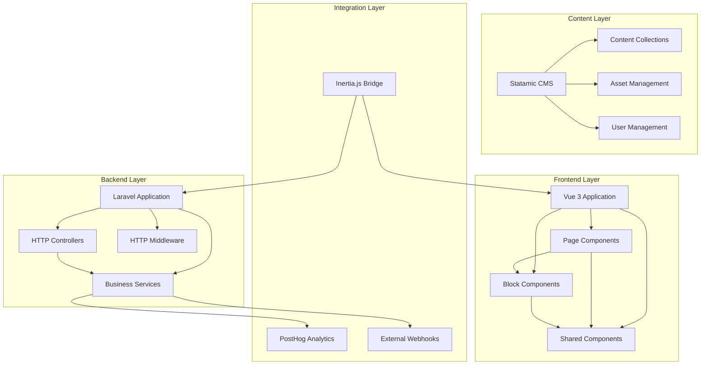

# Components

## Frontend Application (Vue 3)
**Responsibility:** Handles user interface, interactions, and client-side logic

**Key Interfaces:**
- Page components for each route/template
- Reusable block components matching Statamic blocks
- Shared UI components (buttons, forms, layouts)
- Composables for common functionality

**Dependencies:** Inertia.js for server communication, Pinia for state management

**Technology Stack:** Vue 3 Composition API, TypeScript, Tailwind CSS, Vite

## Laravel Application Core
**Responsibility:** Server-side business logic, routing, and data processing

**Key Interfaces:**
- HTTP controllers for page rendering and form processing
- Middleware for authentication, security, and performance
- Services for business logic (lead processing, analytics)
- Event listeners for tracking and integrations

**Dependencies:** Statamic CMS, MySQL database, Redis cache

**Technology Stack:** Laravel 12, PHP 8.3+, Statamic 5.x

## Statamic CMS
**Responsibility:** Content management, user authentication, and file-based content storage

**Key Interfaces:**
- Control Panel for content editing
- Collections API for content retrieval
- User management and authentication
- Asset management for images and files

**Dependencies:** Laravel application core, local file system

**Technology Stack:** Statamic 5.x with flat-file content storage

## Analytics Service
**Responsibility:** Event tracking, user behavior analysis, and performance monitoring

**Key Interfaces:**
- PostHog integration for event tracking
- Laravel event system for data collection
- Custom analytics dashboard (future enhancement)

**Dependencies:** PostHog external service, Laravel events

**Technology Stack:** Laravel events, PostHog JavaScript SDK

## Component Diagrams

