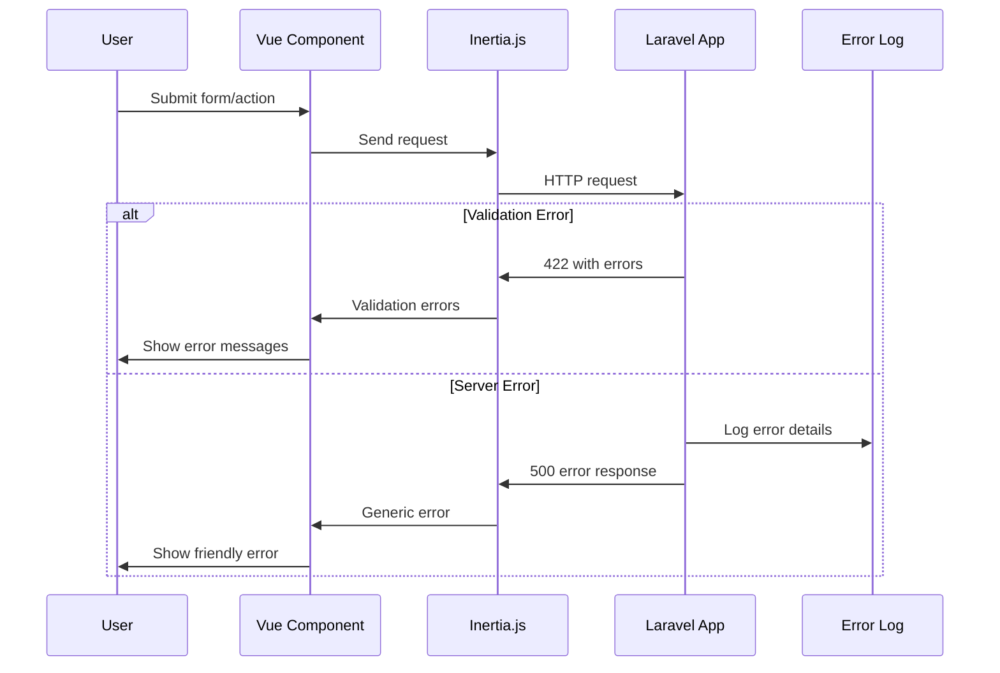

# Error Handling Strategy

## Error Flow


## Error Response Format
```typescript
interface ApiError {
  error: {
    code: string;
    message: string;
    details?: Record<string, any>;
    timestamp: string;
    requestId: string;
  };
}
```

## Frontend Error Handling
```typescript
// composables/useErrorHandler.ts
export function useErrorHandler() {
  const handleInertiaError = (errors: any) => {
    if (errors.response?.status === 422) {
      // Handle validation errors
      return errors.response.data.errors
    }
    
    if (errors.response?.status >= 500) {
      // Handle server errors
      console.error('Server error:', errors)
      return { general: 'Something went wrong. Please try again.' }
    }
    
    // Handle network errors
    return { general: 'Network error. Please check your connection.' }
  }
  
  return { handleInertiaError }
}
```

## Backend Error Handling
```php
<?php

namespace App\Exceptions;

use Illuminate\Foundation\Exceptions\Handler as ExceptionHandler;
use Inertia\Inertia;

class Handler extends ExceptionHandler
{
    public function render($request, Throwable $exception)
    {
        $response = parent::render($request, $exception);
        
        if ($request->expectsJson() || $request->header('X-Inertia')) {
            if ($response->status() >= 500) {
                // Log server errors
                \Log::error('Server error', [
                    'exception' => $exception->getMessage(),
                    'trace' => $exception->getTraceAsString(),
                    'request_id' => $request->header('X-Request-ID')
                ]);
                
                return Inertia::render('Error', [
                    'status' => $response->status(),
                    'message' => 'Something went wrong. Our team has been notified.'
                ])->toResponse($request)->setStatusCode($response->status());
            }
        }
        
        return $response;
    }
}
```