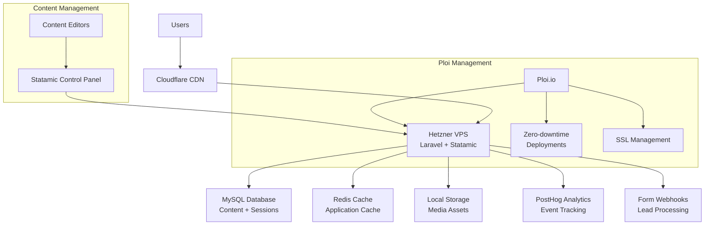

# Smartcraft Marketing Website Architecture Overview

## Introduction

This document outlines the complete fullstack architecture for **Smartcraft Marketing Website**, including backend systems, frontend implementation, and their integration. It serves as the single source of truth for AI-driven development, ensuring consistency across the entire technology stack.

This unified approach combines what would traditionally be separate backend and frontend architecture documents, streamlining the development process for modern fullstack applications where these concerns are increasingly intertwined.

### Starter Template or Existing Project

**Decision**: N/A - Greenfield project with predefined technology stack

Based on the PRD analysis, this is a **greenfield project** with specific technology choices already defined:
- **Backend**: Laravel 12 + Statamic (latest stable)  
- **Frontend**: Inertia.js + Vue 3 (latest) + Vite (latest) + Tailwind (latest)
- **Approach**: Full-stack Laravel application with Inertia.js bridging backend and frontend

The PRD explicitly specifies the tech stack, indicating this is not based on a starter template but rather a custom implementation using these specific technologies.

### Change Log
| Date | Version | Description | Author |
|------|---------|-------------|--------|
| 2025-09-05 | 1.0 | Initial architecture document | Winston (Architect) |

## High Level Architecture

### Technical Summary

The Smartcraft marketing website employs a **modern monolithic architecture** using Laravel 12 as the foundational framework with Statamic CMS for content management, bridged to a Vue 3 frontend via Inertia.js for SPA-like user experience. This architecture delivers enterprise-grade performance and security while maintaining the rapid development velocity of a content-managed system. The platform leverages **server-side rendering with client-side navigation**, providing optimal SEO benefits and user experience. Infrastructure deployment targets Hetzner Cloud via Ploi.io with Cloudflare CDN integration for global performance, aligning with the aggressive performance targets of LCP < 2.5s while supporting the complex page builder and analytics requirements.

### Platform and Infrastructure Choice

**Platform:** Hetzner Cloud via Ploi.io  
**Key Services:** Hetzner VPS, MySQL database, Redis cache, Ploi-managed deployments  
**Deployment Host and Regions:** Hetzner datacenter (EU), Cloudflare CDN for global performance

This approach aligns perfectly with the "WordPress pricing with enterprise features" positioning - leveraging cost-effective hosting while maintaining performance through CDN optimization.

### Repository Structure

**Structure:** Standard Laravel application structure  
**Monorepo Tool:** N/A - Standard Laravel project  
**Package Organization:** Laravel conventions with Statamic integration

```
smartcraft/
├── app/                    # Laravel application logic
├── resources/js/           # Vue 3 + Inertia frontend  
├── resources/views/        # Minimal Blade layouts for Inertia
├── content/               # Statamic content files
├── config/                # Laravel + Statamic configuration
├── public/                # Compiled assets + static files
└── storage/               # File uploads, cache, logs
```

### High Level Architecture Diagram



### Architectural Patterns

- **Simple Monolith:** Single Laravel application with Statamic - *Rationale:* Cost-effective, maintainable, aligns with hosting constraints
- **Content-First Architecture:** Statamic collections drive page structure via replicator fields - *Rationale:* Enables non-technical content management
- **Component-Based UI:** Reusable Vue 3 components mapped to Statamic blocks - *Rationale:* Flexible page building with consistent UI
- **File-Based Content:** Statamic's flat-file approach with database for performance-critical data - *Rationale:* Simplifies content management and version control
- **Event-Driven Analytics:** Laravel events for PostHog tracking - *Rationale:* Clean separation of analytics from business logic